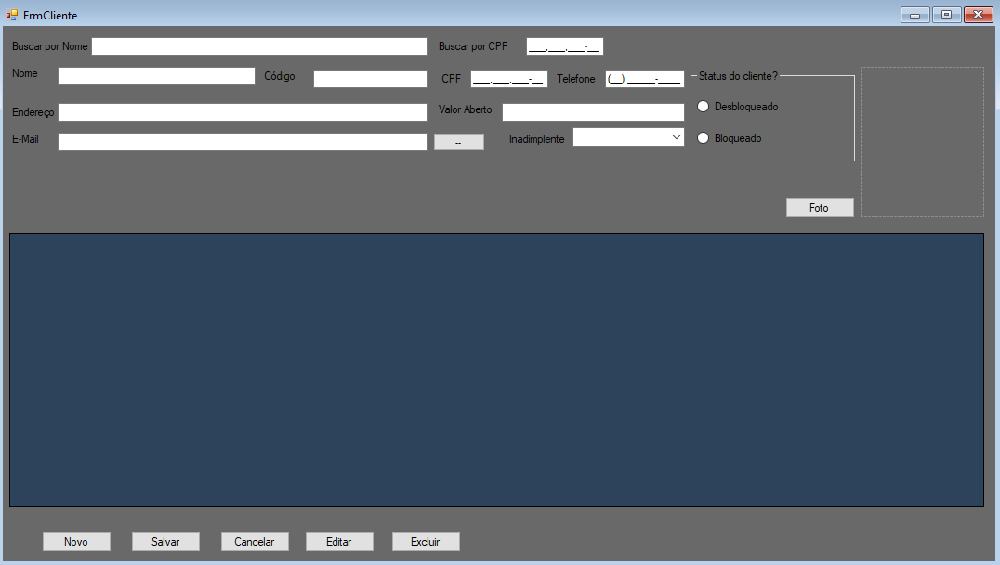

# PDV Completo em C#

>Projeto de PDV completo em C# com MySql.
> Nem todas as configurações estão iguais as dos vídeos. 
> Nos vídeos é criado um outro projeto(Moderno) para criação do design.
> Em seguida é transferido os arquivos do pdv para o novo projeto. 
> `A parte de design eu crio direto neste projeto.`
>>Projeto desenvolvido no curso - Youtube [PDV Completo em C#](https://www.youtube.com/@PortalZatecSistemas)

## Ambiente de Desenvolvimento
    C#, Windows, Microsoft Visual Studio, xampp, MySql

## Documentação
- [C#](https://learn.microsoft.com/pt-br/dotnet/csharp/)
- [Adicionar chave ssh github](https://docs.github.com/pt/authentication/connecting-to-github-with-ssh/checking-for-existing-ssh-keys)
- [freepik - Icons grátis](https://br.freepik.com/icone)
- [pixabay.com - Imagens e icons](https://pixabay.com/pt/vectors/)
- [icoconverter.com - converter para icons](https://www.icoconverter.com/)
- [canva.com criação de artes](https://www.canva.com/)
- [xampp](https://www.apachefriends.org/pt_br/download.html)
- [Nuget package MySql.Data](https://www.nuget.org/packages/MySql.Data/8.3.0?_src=template)
- [Erro MySql incluir imagem] `MySql.Data.MySqlClient.MySqlException: 'Packets larger than max_allowed_packet are not allowed.`


## Desenvolvimento
1. <span style="color:383E42"><b>Preparando ambiente</b></span>
    <details><summary><span style="color:Chocolate">Detalhes</span></summary>
    <p>
    
    - Criar projeto - Aplicativo do Windows Forms(.NET Framework)
    - Editar/Criar README e colocar estrutura básica
    - Criar diretório readmeImages e colocar imagens para uso no README.md
    - Editar/Criar `gitignore` e colocar configuração para `csharp,dotnetcore,windows,visualstudio`
        >Use o site [gitignore.io](https://www.toptal.com/developers/gitignore/)

    </p>

    </details> 

    ---


2. <span style="color:383E42"><b>Criação e Configuração Form Principal</b></span>
    <details><summary><span style="color:Chocolate">Detalhes</span></summary>
    <p>


    - Adicionar item - MenuStrip - ao form
    - Adicionar Itens no menu - Cadastros, Produtos, Movimentações, Relatórios e Sair
        ````
        Alterar propriedade `Names` dos menus: MenuCadastros, MenuProdutos, MenuMovimentacoes, MenuRelatorios, MenuSair
        `````
    - Adicionar 4 PictureBox
        ```
        Incluir imagem na propriedade image do item img01 - Utilizar opção de import - Arquivo de recursos de projeto
        Inclusão das imagens form Principal - picturebox 2, 3, 4
        ```
    - Configurando Menu e Propriedade `name`
    
        Cadastros( name "MenuCadastros"): 
        ````
        Funcionários(name "MenuCadFuncionarios"), Clientes(name "MenuCadClientes"), Usuários(name "MenuCadUsuarios"), Fornecedor(name "MenuCadFornecedor")
        ````
        Produtos(name "MenuProdutos"): 
        ````
        Produtos(name "MenuProdProdutos"), Estoque(name "MenuProdEstoque")
        ````
        Movimentações(name "MenuMovimentacoes"): 
        ````
        Fluxo de caixa(name "MenuMovFluxoDeCaixa"), Lançar venda(name "MenuMovLancarVenda"), Entradas / Saídas(name "MenuMovEntradasSaidas"), Despesas(name "MenuMovDespesas")
        ````
        Relatórios(name "MenuRelatorios"): 
        ````
        Produtos(name "MenuRelProdutos"), Vendas(name "MenuRelVendas"), Movimentos(name "MenuRelMovimentos"), Entradas / Saídas(name "MenuRelEntradasSaídas"), Despesas(name "MenuRelDespesas")
        ````
        Sair(name "MenuSairPrincipal")

    - Criação evento Click Menu Sair(MenuSairPrincipal):
        ````cs
        private void MenuSairPrincipal_Click(object sender, EventArgs e)
        {
            this.Close();
        }
        ````


    </p>

    </details> 

    ---


3. <span style="color:383E42"><b>Criação Pasta cadastro e Form Cadastro(frmCadastro)</b></span>
    <details><summary><span style="color:Chocolate">Detalhes</span></summary>
    <p>

    - Adicionar uma nova pasta "cadastro" ao projeto - Adicionar novo form frmCadastro na pasta criada

    - Criar evento Click do Submenu Funcionários(MenuCadFuncionario - do Menu Cadastros)
        ````cs
        private void MenuCadFuncionario_Click(object sender, EventArgs e)
        {
            cadastro.frmCadastro frm=new cadastro.frmCadastro();

            frm.ShowDialog();
        }
        ````
    - Renomeação dos nomes dos forms, propriedade `Name`
        ````
        Novo nome FrmPrincipal e FrmCadastro
        ````

    - Alteração ícone do form principal e cadastro
        ```
        Selecionar ícone na propriedade `Icon` do formulário
        ```
    - Inclusão dos labels no FrmCadastro:
        ````
        Nome, Telefone, Endereço, CPF, Cargo e Foto
        ````
    - Inclusão dos TextBox do FrmCadastro:
        ````
        Nome, Telefone, Endereço, CPF
        txtNome, txtTelefone, txtcEndereco, txtCPF
        ````
    - Inclusão ComboBox do FrmCadastro:
        ````
        Cargo
        cmboxCadFuncCargo
        ````
    - Inclusão PictureBox do FrmCadastro:
        ````
        Foto
        pictboxFoto
        ````
    - Inclusão DataGridView do FrmCadastro: 
      Desabilitar inclusão pelo componente
        ````
        dtgridListFuncionarios
        ````
    - Adicionar botões: 
        ````
        Novo(btnNovo), Salvar(btnSalvar), Editar(btnEditar), Excluir(btnExcluir)
        ````

    </p>

    </details> 

    ---


4. <span style="color:383E42"><b>Instalar o Xampp, Criar Database e Tabelas </b></span>
    <details><summary><span style="color:Chocolate">Detalhes</span></summary>
    <p>

    - [Coorrigir problema alerta ao instalar](https://www.youtube.com/watch?v=JDn4vzT9C38)
    - Criar database `pdv`
    - Criar tabela `funcionarios`:
        ````
        id - int - AI(auto Incremente)
        nome - varchar - 80
        cpf - varchar - 20
        telefone - varchar - 20
        cargo - varchar - 30
        data - date
        endereco -  varchar - 300
        foto - longblob
        ````
    - Instalar via Nuget package `Mysql.Data` 

    </p>

    </details> 

    ---


5. <span style="color:383E42"><b>Criar Classe de Conexão</b></span>
    <details><summary><span style="color:Chocolate">Detalhes</span></summary>
    <p>

    Criar classe `Conexao.cs`
    ````cs
    using MySql.Data.MySqlClient;
    using System;
    using System.Windows.Forms;

    namespace pdv_windowsforms
    {
        internal class Conexao
        {
            //Para uso em servidor local
            public string conec = "server=localhost;uid=root;pwd=;database=pdv;port=;";


            public MySqlConnection con = null;

            public void abrirConexao()
            {
                try
                {
                    con = new MySqlConnection(conec);
                    con.Open();
                }catch (Exception ex)
                {
                    //Ao inves do throw ex; usar o messageBox, assim o sistema pode ser usado mesmo dando erro ao abrir o BD
                    MessageBox.Show("Erro de conexao com o Banco de Dados"+ex.Message);
                }
            }

            public void fecharConexao()
            {
                try
                {
                    con = new MySqlConnection(conec);
                    con.Close();
                    con.Dispose();//derruba algumas conexoes abertas
                    con.ClearAllPoolsAsync();//Metodo de limpeza
                }catch(Exception ex)
                {
                    //Ao inves do throw ex; usar o messageBox, assim o sistema pode ser usado mesmo dando erro ao abrir o BD
                    MessageBox.Show("Erro de conexao com o Banco de Dados" + ex.Message);
                }
            }
        }
    }

    ````

    </p>

    </details> 

    ---

6. <span style="color:383E42"><b>Criar Código Básico Opção de Salvar FrmFuncionario</b></span>
    <details><summary><span style="color:Chocolate">Detalhes</span></summary>
    <p>

    - Criar botão Foto
        ````
        btnOpenDialog
        ````
    - Excluir label do campo foto FrmFuncionario
    - Criar evento click do btnSalvar FrmFuncionar
    - Criar evento click do btnOpenDialog FrmFuncionario
    - Criar função img() FrmFuncionario
    - Criar função limparFoto()
    - Código resultante:
        ````cs
        using MySql.Data.MySqlClient;
        using System;
        using System.IO;
        using System.Windows.Forms;

        namespace pdv_windowsforms.cadastro
        {
            public partial class FrmFuncionario : Form
            {
                Conexao con = new Conexao();
                String sql;
                MySqlCommand cmd;

                String foto;

                public FrmFuncionario()
                {
                    InitializeComponent();
                }

                private void btnSalvar_Click(object sender, EventArgs e)
                {

                    con.abrirConexao();
                    sql = "insert into funcionarios(nome, cpf, endereco, telefone, cargo, data, foto) values(@nome, @cpf, @endereco, @telefone, @cargo, curDate(), @foto)";
                    cmd = new MySqlCommand(sql, con.con);
                    cmd.Parameters.AddWithValue("@nome", txtNome.Text);
                    cmd.Parameters.AddWithValue("@cpf", txtCPF.Text);
                    cmd.Parameters.AddWithValue("@endereco", txtEndereco.Text);
                    cmd.Parameters.AddWithValue("@telefone", txtTelefone.Text);
                    cmd.Parameters.AddWithValue("@cargo", cbCargo.Text);
                    cmd.Parameters.AddWithValue("@foto", img());//img() método criado para tratar imagem para o database


                    cmd.ExecuteNonQuery();
                    con.fecharConexao();
                }

                private void FrmCadastro_Load(object sender, EventArgs e)
                {


                }

                private void btnOpenDialog_Click(object sender, EventArgs e)
                {
                    OpenFileDialog dialog = new OpenFileDialog();
                    //dialog.Filter = "Arquivos(*.jpg)|*.jpg | Arquivos(*.png)| *.png;| All (*.*) | *.*"; //Mostra um de cada vez
                    dialog.Filter = "Imagens(*.jpg; *.png) | *.jpg;*.png"; //Mostra jpg e png
                    if (dialog.ShowDialog() == DialogResult.OK)
                    {
                        foto = dialog.FileName.ToString();//pegando caminho da imagem
                        pictboxFoto.ImageLocation = foto; //Jogando caminho da imgem para comonente img para exibir no form
                        //alterouImagem = "sim"; //para uso editar alterando imagem
                    }
                }

                private byte[] img()//Este metodo é padrão, serve sempre que desejar enviar imagem para o banco de dados
                {
                    byte[] imagem_byte = null;
                    if(foto == "") //a string foto, nuca vai estar vazia, porque no metodo LimparFoto() foi passado o caminho de uma imagem
                    {
                        return null;
                    }

                    //usar o FileStream para enviar imagem para o BD e tres parâmetros local(foto), tipo de imagem(FileMode), tipo de acesso(FileAcess)
                    FileStream fs = new FileStream(foto, FileMode.Open, FileAccess.Read);//padrão
                    BinaryReader br = new BinaryReader(fs);//serve para trabalhar com FileStream

                    imagem_byte = br.ReadBytes((int)fs.Length);

                    return imagem_byte;

                }
                private void limparFoto()
                {
                    pictboxFoto.Image = Properties.Resources.perfil; //Aqui coloca a imagem sem foto na picutre do form
                    foto = "img/sem_foto.jpg"; //atribuido um caminho de foto (assim esta imagem tem que estar na pasta debug
                }
            }
        }

        ````


    </p>

    </details> 

    ---


7. <span style="color:383E42"><b>Validação para `Nome` e `CPF` FrmFuncionario - Inclusão Máscara </b></span>
    <details><summary><span style="color:Chocolate">Detalhes</span></summary>
    <p>

    - Validação `txtNome`
        ````cs
        //Tratar dados
        if(txtNome.Text.ToString().Trim() == "")
        {
            MessageBox.Show("Preencha o campo nome", "Cadastro funcionários", MessageBox.ok, MessageBoxIcon.Warning);
            txtNome.Text = "";
            txtNome.Focus();
            return;
        }
        ````
    - Validação `txtCpf`
    Exclusão do `txtCPF` do FrmFuncionario e inclusão do MaskedTextBox `txtCpf`
        ````cs
        if(txtCpf.Text == "   ,   ,   -" || txtCpf.Text.Length < 14)
        {
            MessageBox.Show("Preencha o campo CPF", "Cadastro funcionários", MessageBoxButtons.OK, MessageBoxIcon.Warning);
            txtCpf.Text = "";
            txtCpf.Focus();
            return;
        }
        ````
    - Exclusão `txtTelefone` e inclusão de campo MaskedTextBox `txtTelefone`
    
    - Incluir pasta `img` na pasta debug do projeto
        A imagem que é incluída via função `limpaFoto()` deve ficar na pasta `debug`
        ````
        pdv-windowsforms\bin\Debug
        ````
    - Incluir chamada da função `limpaFoto` no evento load do `FrmCadastro`
        Função inclui foto padrão para o campo foto.
        Obs.: Incluir imagem uma vez via propriedade Image do campo para, constar nos resources. Evitando erros.
        ````cs
        private void FrmCadastro_Load(object sender, EventArgs e)
        {
            limparFoto();

        }
        ````


    </p>

    </details> 

    ---

8. <span style="color:383E42"><b>Criar Funções para Limpar, Habilitar/Desabilitar Campos FrmCadastro</b></span>
    <details><summary><span style="color:Chocolate">Detalhes</span></summary>
    <p>

    - Alterar nome `btnOpenDialog`para `btnFoto`
    - Criar função `habilitarCampos`
        ````cs
        private void habilitarCampos()
        {
            btnSalvar.Enabled = true;
            txtNome.Enabled = true;
            txtCpf.Enabled = true;
            txtEndereco.Enabled = true;
            txtTelefone.Enabled = true;
            btnCancelar.Enabled = true;
            btnFoto.Enabled = true;
            btnNovo.Enabled = false;
        }
        ````
    - Criar função `limparCampos`
        ````cs
        private void limparCampos()
        {
            txtNome.Clear();
            txtCpf.Clear();
            txtEndereco.Clear();
            txtTelefone.Clear();
            
        }
        ````
    - Criar função `desabilitarCampos`
        ````cs
        private void desabilitarCampos()
        {
            txtNome.Enabled=false;
            txtCpf.Enabled=false;
            txtEndereco.Enabled=false;
            txtTelefone.Enabled=false;
            cbCargo.Enabled=false;
        }
        ````
    - Criar envento `btnNovo_Click` botão `Novo` form FrmCadastro
        ````cs
        private void btnNovo_Click(object sender, EventArgs e)
        {
            habilitarCampos();
        }
        ````
    - Incluir em evento click do botão `Salvar` FrmCadastro:
        ````cs
        limparFoto();

        MessageBox.Show("Registro Salvao com Sucesso!","Cadastro funcionário", MessageBoxButtons.OK, MessageBoxIcon.Information);
        btnNovo.Enabled = true;
        btnSalvar.Enabled = false;
        btnEditar.Enabled = false;
        btnExcluir.Enabled = false;

        limparCampos();
        desabilitarCampos();
        ````


    </p>

    </details> 

    ---


9. <span style="color:383E42"><b>Criar Função `listar()` formatarGD()</b></span>
    <details><summary><span style="color:Chocolate">Detalhes</span></summary>
    <p>

    - Criar função `listar()` para trazer os dados para o `datagrid` FrmFuncionario
        ````cs
        private void listar()
        {
            con.abrirConexao();
            sql = "select * from funcionarios order by nome asc";
            cmd = new MySqlCommand(sql, con.con);
            MySqlDataAdapter dataAdapter = new MySqlDataAdapter(cmd);
            dataAdapter.SelectCommand = cmd;
            DataTable dataTable = new DataTable();
            dataAdapter.Fill(dataTable);
            dtgridListFuncionarios.DataSource = dataTable;
            con.fecharConexao();
        }
        ````

    - Incluir chamada método `listar()` no evento load do FrmCadastro e evento click de btnSalvar
        FrmCadastro_Load
        ````cs
        private void FrmCadastro_Load(object sender, EventArgs e)
        {
            limparFoto();
            listar();

        }
        ````
        btnSalvar_Click
        ````cs
        //...
        limparFoto();
        listar();
        //...
        ````
    - Criar método para formatar grid `dtgridListFuncionarios` e incluir chamad no método `listar()`
        ````cs
        private void formatarGD()
        {
            dtgridListFuncionarios.Columns[0].HeaderText = "ID";
            dtgridListFuncionarios.Columns[1].HeaderText = "Nome";
            dtgridListFuncionarios.Columns[2].HeaderText = "CPF";
            dtgridListFuncionarios.Columns[3].HeaderText = "Telefone";
            dtgridListFuncionarios.Columns[4].HeaderText = "Cargo";
            dtgridListFuncionarios.Columns[5].HeaderText = "Data";
            dtgridListFuncionarios.Columns[6].HeaderText = "Endereço";
            dtgridListFuncionarios.Columns[7].HeaderText = "Imagem";

            dtgridListFuncionarios.Columns[0].Width = 50;
            dtgridListFuncionarios.Columns[6].Width = 50;
            dtgridListFuncionarios.Columns[0].Visible = false;
            dtgridListFuncionarios.Columns[7].Visible = false;
        }
        ````


    </p>

    </details> 

    ---


10. <span style="color:383E42"><b>Capturar Validar Dados e Exibir Imagem do dataGrid `dtgridListFuncionarios`</b></span>
    <details><summary><span style="color:Chocolate">Detalhes</span></summary>
    <p>

    - Criar evento para duplo click na celula grid `dtgridListFuncionarios`
        Trata imagem
        ````cs
        private void dtgridListFuncionarios_CellDoubleClick(object sender, DataGridViewCellEventArgs e)
        {
            if(e.RowIndex > -1)
            {
                habilitarCampos();
                btnEditar.Enabled = true;
                btnExcluir.Enabled = true;
                btnSalvar.Enabled = false;
                btnNovo.Enabled = false;

                txtNome.Text = dtgridListFuncionarios.CurrentRow.Cells[1].Value.ToString();
                txtCpf.Text = dtgridListFuncionarios.CurrentRow.Cells[2].Value.ToString();
                txtTelefone.Text = dtgridListFuncionarios.CurrentRow.Cells[3].Value.ToString();
                cbCargo.Text = dtgridListFuncionarios.CurrentRow.Cells[4].Value.ToString();
                txtEndereco.Text = dtgridListFuncionarios.CurrentRow.Cells[6].Value.ToString();

                if (dtgridListFuncionarios.CurrentRow.Cells[7].Value != DBNull.Value)
                {
                    //Criada var byte[] imagem para receber convertido em byte o que vem da grid
                    byte[] imagem = (byte[])dtgridListFuncionarios.Rows[e.RowIndex].Cells[7].Value;
                    MemoryStream ms = new MemoryStream(imagem);

                    // O componente Image sempre pede um System.Drawing então...
                    // Passando o memorystream no objeto que ele recebe um System.Drawing e seu parametro FromStream
                    pictboxFoto.Image = System.Drawing.Image.FromStream(ms);
                }
                else
                {
                    pictboxFoto.Image = Properties.Resources.sem_foto2; //Aqui coloca a imagem sem foto na picture do form
                }

            }else
            {
                return;
            }
        ````
    - Colocar foco campo nome evento click `btnNovo` FrmFuncionario
        ````cs
        txtNome.Focus();
        ````
    - Configurar ordem dos campos para seleção/edição propridade `TabIndex`
    - Criação evento click botão cancelar btnCancelar
        ````cs
        private void btnCancelar_Click(object sender, EventArgs e)
        {
            btnEditar.Enabled = false;
            btnExcluir.Enabled = false;
            btnSalvar.Enabled = false;
            btnNovo.Enabled = true;

            desabilitarCampos();
            limparCampos();

        }
        ````
    - Incluir chamada método limparCampos() ao evento click do botão Novo
        ````cs
        private void btnNovo_Click(object sender, EventArgs e)
        {
            habilitarCampos();
            limparCampos() ;
            txtNome.Focus();
        }
        ````
 

    </p>

    </details> 

    ---


11. <span style="color:383E42"><b>Criação evento click Botão Editar e Excluir FrmFuncionario</b></span>
    <details><summary><span style="color:Chocolate">Detalhes</span></summary>
    <p>

    - Erro MySql incluir imagem `MySql.Data.MySqlClient.MySqlException: 'Packets larger than max_allowed_packet are not allowed.`
        Solução [Altere o arquivo my.ini - max_allowed_packet=500M](https://stackoverflow.com/questions/8062496/how-to-change-max-allowed-packet-size)
    
    - Criação variáveis `id` e `cpfAntigo`
        ````cs
        String id = "";
        String cpfAntigo = "";
        ````
    - Criar evento click do botão `Editar`
        ````cs
        private void btnEditar_Click(object sender, EventArgs e)
        {
            if(txtNome.Text.ToString().Trim() == "")
            {
                MessageBox.Show("Preencha o campo nome.", "Cadastro funcionários", MessageBoxButtons.OK, MessageBoxIcon.Warning);
                txtNome.Text = "";
                txtNome.Focus();
                return;
            }
            if(txtCpf.Text == "   ,   ,   -" || txtCpf.Text.Length < 14)
            {
                MessageBox.Show("Preencha o campo CPF.", "Cadastro funcionários", MessageBoxButtons.OK, MessageBoxIcon.Warning);
                txtCpf.Focus();
                return;
            }

            //Botão Editar
            if(alterouImagem == "sim")
            {
                con.abrirConexao();
                sql = "update funcionarios set nome = @nome, cpf = @cpf, telefone = @telefone, cargo = @cargo, endereco = @endereco, foto = @foto where id = @id";
                cmd = new MySqlCommand(sql, con.con);
                cmd.Parameters.AddWithValue("@id", id);
                cmd.Parameters.AddWithValue("@nome", txtNome.Text);
                cmd.Parameters.AddWithValue("@cpf", txtCpf.Text);
                cmd.Parameters.AddWithValue("@telefone", txtTelefone.Text);
                cmd.Parameters.AddWithValue("@cargo", cbCargo.Text);
                cmd.Parameters.AddWithValue("@endereco", txtEndereco.Text);
                cmd.Parameters.AddWithValue("@foto", img());//img() método criado para tratar imagem para o database
            }else if(alterouImagem == "não")
            {
                con.abrirConexao();
                sql = "update funcionarios set nome = @nome, cpf = @cpf, telefone = @telefone, cargo = @cargo, endereco = @endereco where id = @id";
                cmd = new MySqlCommand(sql, con.con);
                cmd.Parameters.AddWithValue("@id", id);
                cmd.Parameters.AddWithValue("@nome", txtNome.Text);
                cmd.Parameters.AddWithValue("@cpf", txtCpf.Text);
                cmd.Parameters.AddWithValue("@telefone", txtTelefone.Text);
                cmd.Parameters.AddWithValue("@cargo", cbCargo.Text);
                cmd.Parameters.AddWithValue("@endereco", txtEndereco.Text);

            }

            //Verifica se CPF já existe
            if(txtCpf.Text != cpfAntigo)
            {
                MySqlCommand cmdVerificar;
                cmdVerificar = new MySqlCommand("Select * from funcionarios where cpf = @cpf", con.con);
                MySqlDataAdapter da = new MySqlDataAdapter();
                da.SelectCommand = cmdVerificar;
                cmdVerificar.Parameters.AddWithValue("@cpf",txtCpf.Text);
                DataTable dt = new DataTable();
                da.Fill(dt);

                if(dt.Rows.Count > 0)
                {
                    MessageBox.Show("CPF já registrado", "Cadastro de Funcionários", MessageBoxButtons.OK, MessageBoxIcon.Stop);
                    txtCpf.Text = "";
                    txtCpf.Focus();
                    return;
                }

            }

            cmd.ExecuteNonQuery();
            con.fecharConexao();
            listar();

            MessageBox.Show("Registro Editado com sucesso!", "Cadastro de Funcionários", MessageBoxButtons.OK, MessageBoxIcon.Information);
            btnNovo.Enabled = true;
            btnEditar.Enabled = false;
            btnExcluir.Enabled = false;
            btnSalvar.Enabled = false;
            desabilitarCampos();
            limparCampos();
            limparFoto();
            alterouImagem = "não";

        }
        ````
    - Criação do evento click do botão `Excluir`
        ````cs
        private void btnExcluir_Click(object sender, EventArgs e)
        {
            var res = MessageBox.Show("Deseja realmente Excluir!", "Exclusão", MessageBoxButtons.YesNo, MessageBoxIcon.Question);
            
            if (res == DialogResult.Yes)
            {

                con.abrirConexao();
                sql = "delete from funcionarios where id = @id";
                cmd = new MySqlCommand(sql, con.con);
                cmd.Parameters.AddWithValue("@id", id);
                cmd.ExecuteNonQuery();
                con.fecharConexao();
                listar();
                MessageBox.Show("Registro Exluído com sucesso!", "Cadastro de Funcionários", MessageBoxButtons.OK, MessageBoxIcon.Information);
                btnNovo.Enabled=true;
                btnEditar.Enabled=false;
                btnExcluir.Enabled=false;
                btnSalvar.Enabled=false;
                desabilitarCampos();
                limparCampos();
                limparFoto();

            }
        }
        ````

    </p>

    </details> 

    ---


12. <span style="color:383E42"><b>ComboBox `cbCargo`: Criação Tabela `cargos`, Função `listarCargos`</b></span>
    <details><summary><span style="color:Chocolate">Detalhes</span></summary>
    <p>

    - Criação Tabela `cargos` e inclusão de dados
        - id - int - autoincrement
        - cargo- varchar
        ````sql
        INSERT INTO `cargos` (`id`, `nome`) VALUES (NULL, 'Motorista');
        ````

    - Criar Função `listarCargos`
        ````cs
        private void listarCargos()
        {
            con.abrirConexao();
            sql = "SELECT * FROM cargos ORDER BY cargo ASC";
            cmd = new MySqlCommand(sql, con.con);
            MySqlDataAdapter da = new MySqlDataAdapter();
            da.SelectCommand = cmd;
            DataTable dt = new DataTable();
            da.Fill(dt);
            cbCargo.DataSource = dt;
            //cbCargo.ValueMember = "id";
            //Carrega pelo nome 
            cbCargo.DisplayMember = "cargo";
            con.fecharConexao();

        }
        ````


    </p>

    </details> 

    ---

13. <span style="color:383E42"><b>Criar Form Cargo, Formatar Grid e Criar Código do Botão Salvar</b></span>
    <details><summary><span style="color:Chocolate">Detalhes</span></summary>
    <p>

    - Configurar texto inicial no cbCargo no evento Load FrmFuncionario
        ````cs
        cbCargo.Text = "Selecione o Cargo";
        ````
    - Configurar propriedade SelectionMode do datagrid como `FullRowSelect`
        Com isso será selecionada toda linha ao clicar em uma célula na tabela

    - Criar novo formulário FrmCargo - Copiar campos e botões do `FrmFuncionario` e deixar somente os campos abaixo
        Campos:
        - Label Cargo: lblCargo
        - TextBox: txtCargo
        - DataGrid: dtgridListCargos
        Botões:
        - Novo: btnNovo
        - Salvar: btnSalvar
        - Cancelar: btnCancelar
        - Editar: btnEditar
        - Excluir: btnExcluir

    
    - Incluir variáveis no FrmCargo
        ````cs
        Conexao con = new Conexao();
        string sql;
        MySqlCommand cmd;

        string id = "";

        ````

    - Incluir função formatarGD()
        ````cs
        private void formatarGD()
        {
            dtgridListCargos.Columns[0].HeaderText = "ID";
            dtgridListCargos.Columns[1].HeaderText = "Cargo";

            dtgridListCargos.Columns[0].Width = 50;
            dtgridListCargos.Columns[1].Width = 50;
            dtgridListCargos.Columns[0].Visible = false;
        }
        ````
    - Criar evento click botão salvar FrmCargo
        ````cs
        private void btnSalvar_Click(object sender, EventArgs e)
        {
            //Tratar dados
            if (txtCargo.Text.ToString().Trim() == "" || txtCargo.Text.Length < 2)
            {
                MessageBox.Show("Preencha o campo Cargo com pelo menos 2 letras", "Cadastro Cargos", MessageBoxButtons.OK, MessageBoxIcon.Warning);
                txtCargo.Text = "";
                txtCargo.Focus();
                return;
            }

            con.abrirConexao();
            sql = "insert into cargos(cargo) values(@cargo)";
            cmd = new MySqlCommand(sql, con.con);
            cmd.Parameters.AddWithValue("@cargo", txtCargo.Text);


            cmd.ExecuteNonQuery();
            con.fecharConexao();


            listar();

            MessageBox.Show("Registro Salvao com Sucesso!", "Cadastro Cargos", MessageBoxButtons.OK, MessageBoxIcon.Information);
            btnNovo.Enabled = true;
            btnSalvar.Enabled = false;
            btnEditar.Enabled = false;
            btnExcluir.Enabled = false;

        }
        ````
    - Criar função listar() e incluir chamada no evento Load do FrmCargo
        ````cs
        private void listar()
        {
            con.abrirConexao();
            sql = "select * from cargos order by cargo asc";
            cmd = new MySqlCommand(sql, con.con);
            MySqlDataAdapter dataAdapter = new MySqlDataAdapter(cmd);
            dataAdapter.SelectCommand = cmd;
            DataTable dataTable = new DataTable();
            dataAdapter.Fill(dataTable);
            dtgridListCargos.DataSource = dataTable;
            con.fecharConexao();

            formatarGD();
        }
        ````
    - Incluir Cadastro cargos no menu Form principal e criar evento click
        ````cs
        private void MenuCadCargos_Click(object sender, EventArgs e)
        {
            cadastro.FrmCargo frmCargo = new cadastro.FrmCargo();
            frmCargo.ShowDialog();
        }
        ````
    - Incluir função formatarGD()
        ````cs
        private void formatarGD()
        {
            dtgridListCargos.Columns[0].HeaderText = "ID";
            dtgridListCargos.Columns[1].HeaderText = "Cargo";

            dtgridListCargos.Columns[0].Width = 50;
            dtgridListCargos.Columns[1].Width = 50;
            dtgridListCargos.Columns[0].Visible = false;
        }
        ````


    </p>

    </details> 

    ---


14. <span style="color:383E42"><b>Incluir as Funções/Eventos dos Botões do FrmCargo</b></span>
    <details><summary><span style="color:Chocolate">Detalhes</span></summary>
    <p>
 
    - Criar código do evento click do btnCancelar 
        ````cs
        private void btnCancelar_Click(object sender, EventArgs e)
        {
            btnEditar.Enabled = false;
            btnExcluir.Enabled = false;
            btnSalvar.Enabled = false;
            btnNovo.Enabled = true;
        }
        ````
    - Código evento click `btnEditar`
        ````cs
                private void btnEditar_Click(object sender, EventArgs e)
        {
            if (txtCargo.Text.ToString().Trim() == "")
            {
                MessageBox.Show("Preencha o campo Cargo.", "Cadastro Cargos", MessageBoxButtons.OK, MessageBoxIcon.Warning);
                txtCargo.Text = "";
                txtCargo.Focus();
                return;
            }

            con.abrirConexao();

            //Verifica se Cargo já existe
            if (txtCargo.Text != cargoAntigo)
            {
                MySqlCommand cmdVerificar;
                cmdVerificar = new MySqlCommand("Select * from cargos where cargo = @cargo", con.con);
                MySqlDataAdapter da = new MySqlDataAdapter();
                da.SelectCommand = cmdVerificar;
                cmdVerificar.Parameters.AddWithValue("@cargo", txtCargo.Text);
                DataTable dt = new DataTable();
                da.Fill(dt);

                if (dt.Rows.Count > 0)
                {
                    MessageBox.Show("Cargo já registrado", "Cadastro de Cargos", MessageBoxButtons.OK, MessageBoxIcon.Stop);
                    txtCargo.Text = "";
                    txtCargo.Focus();
                    return;
                }

            }

            //Botão Editar
            sql = "update cargos set cargo = @cargo where id = @id";
            cmd = new MySqlCommand(sql, con.con);
            cmd.Parameters.AddWithValue("@id", id);
            cmd.Parameters.AddWithValue("@cargo", txtCargo.Text);

            cmd.ExecuteNonQuery();
            con.fecharConexao();
            listar();

            MessageBox.Show("Registro Editado com sucesso!", "Cadastro de Cargos", MessageBoxButtons.OK, MessageBoxIcon.Information);
            btnNovo.Enabled = true;
            btnEditar.Enabled = false;
            btnExcluir.Enabled = false;
            btnSalvar.Enabled = false;
            txtCargo.Text = "";
        }
        ````
    - Código evento duplo click `dtgridListCargos`
        ````cs
                private void dtgridListCargos_CellDoubleClick(object sender, DataGridViewCellEventArgs e)
        {
            if (e.RowIndex > -1)
            {
                btnEditar.Enabled = true;
                btnExcluir.Enabled = true;
                btnSalvar.Enabled = false;
                btnNovo.Enabled = false;

                id = dtgridListCargos.CurrentRow.Cells[0].Value.ToString();
                txtCargo.Text = dtgridListCargos.CurrentRow.Cells[1].Value.ToString();
            }
        }
        ````
    - Código evento click `btnExcluir`
        ````cs
        private void btnExcluir_Click(object sender, EventArgs e)
        {
            var res = MessageBox.Show("Deseja realmente Excluir o cargo!", "Exclusão", MessageBoxButtons.YesNo, MessageBoxIcon.Question);

            if (res == DialogResult.Yes)
            {

                con.abrirConexao();
                sql = "delete from cargos where id = @id";
                cmd = new MySqlCommand(sql, con.con);
                cmd.Parameters.AddWithValue("@id", id);
                cmd.ExecuteNonQuery();
                con.fecharConexao();
                listar();
                MessageBox.Show("Cargo Exluído com sucesso!", "Cadastro de Cargos", MessageBoxButtons.OK, MessageBoxIcon.Information);
                btnNovo.Enabled = true;
                btnEditar.Enabled = false;
                btnExcluir.Enabled = false;
                btnSalvar.Enabled = false;
                txtCargo.Text = "";

            }
        }
        ````
    - Criação campo data tabela `cargos`
        `Tipo Date - Não nulo`
    - Inclusão do campo `data` no evento click `btnSalvar`
        ````cs
        //...
        sql = "insert into cargos(cargo, data) values(@cargo, curDate())";
        //...
        ````
    - Incluir configuração inicial botões e campo texto evento Load FrmCadastro
        ````cs
        //...
            btnNovo.Enabled = true;
            btnEditar.Enabled = false;
            btnExcluir.Enabled = false;
            btnSalvar.Enabled = false;
            txtCargo.Enabled = false;
        //...
        ````
    - Habilitar btnSalvar click do botão `Novo`
        ````cs
        //...
        btnSalvar.Enabled = true;
        //...
        ````

    - Edição das mensagens de alerta ao editar e excluir cargo

    - Inclusão do cargo clicado na grid a variável `cargoAntigo`
        ````cs
        //...
        cargoAntigo = dtgridListCargos.CurrentRow.Cells[1].Value.ToString();//Não necessário, pois este valor já está no txtCargo.Text
        /...
        ````


    </p>

    </details> 

    ---


15. <span style="color:383E42"><b>Criando Form Cliente - Importando Database de Script SQL</b></span>
    <details><summary><span style="color:Chocolate">Detalhes</span></summary>
    <p>
    
    - Importando datase do script:
        Excluir tabelas do banco de dados `pdv` ou excluir o banco e recriar
        Estando no banco de dados via phpMyAdmin menu Importar
        Escolher arquivo baixado do curso
        Opções:
        - Conjunto de caracteres do arquivo: utf-8
        - Formato: SQL
        - Modo de compatibilidade SQL: NONE

    - Criar formulário Clientes (FrmCliente):
        > `StartPosition - CenterScreen`
        >>
    

    - Criar variáveis do form
    - Criar o função `formatarGD`
        Formata a datagridList
        ````cs
        private void formatarGD()
        {
            dtgridListClientes.Columns[0].HeaderText = "ID";
            dtgridListClientes.Columns[1].HeaderText = "Código";
            dtgridListClientes.Columns[2].HeaderText = "Nome";
            dtgridListClientes.Columns[3].HeaderText = "CPF";
            dtgridListClientes.Columns[4].HeaderText = "Em Aberto";
            dtgridListClientes.Columns[5].HeaderText = "Telefone";
            dtgridListClientes.Columns[6].HeaderText = "Email";
            dtgridListClientes.Columns[7].HeaderText = "Desbloqueado";
            dtgridListClientes.Columns[8].HeaderText = "Status";
            dtgridListClientes.Columns[9].HeaderText = "Endereço";
            dtgridListClientes.Columns[10].HeaderText = "Funcionário";
            dtgridListClientes.Columns[11].HeaderText = "igm";
            dtgridListClientes.Columns[12].HeaderText = "Data";
            //dtgridListClientes.Columns[0].Width = 50;
            dtgridListClientes.Columns[0].Visible = false;
            dtgridListClientes.Columns[11].Visible = false;
            dtgridListClientes.Columns[4].DefaultCellStyle.Format = "c2";


        }
        ````
    - Criar função `listar`
        Preenche o datagridList com dados da tabela de clientes
        ````cs
        private void listar()
        {
            con.abrirConexao();
            sql = "select * from clientes order by nome asc";
            cmd = new MySqlCommand(sql, con.con);
            MySqlDataAdapter adapter = new MySqlDataAdapter();
            adapter.SelectCommand = cmd;
            DataTable dt = new DataTable();
            adapter.Fill(dt);
            dtgridListClientes.DataSource = dt;
            con.fecharConexao();

            formatarGD();
        }
        ````
    - Criar função `habilitarCampos`
        ````cs
        private void habilitarCampos()
        {
            txtNome.Enabled = true;
            txtCpf.Enabled = true;
            txtEndereco.Enabled = true;
            txtTelefone.Enabled = true;
            txtEmail.Enabled = true;
            cblInadimplente.Enabled = true;
            txtValorAberto.Enabled = true;
            txtNome.Focus();
        }
        ````
    - Criar função `desabilitarCampos`
        ````cs
        private void desabilitarCampos()
        {
            txtNome.Enabled = false;
            txtCpf.Enabled = false;
            txtEndereco.Enabled = false;
            txtTelefone.Enabled = false;
            txtEmail.Enabled = false;
            cblInadimplente.Enabled = false;
            txtValorAberto.Enabled = false;
        }
        ````
    - Criar função `limparCampos`
        ````cs
        private void limparCampos()
        {
            txtNome.Text = "";
            txtCpf.Text = "";
            txtEndereco.Text = "";
            txtTelefone.Text = "";
            txtEmail.Text = "";
            cblInadimplente.SelectedIndex = 0;
        }
        ````
    - Criar função `buscarPNome`
    - Criar função `buscarCpf`
    - Criar função `ultimoIdCliente`
    - Criar função `img`
        Este método é padrão, serve para enviar um imagem para o banco de dados.
    - Criar função `limparFoto`
 
    </p>

    </details> 

    ---


16. <span style="color:383E42"><b>Design das Telas/Forms</b></span>
    <details><summary><span style="color:Chocolate">Detalhes</span></summary>
    <p>

    - Remover o menu menuStrip1 do Form1.
    - Adicionar um Panel ao form Form1 - `panelMenu`
        ````
        - Dock a esquerda - BackColor: ControlDarkDark  
          Size: 220; 615
        ````
    - Adicionar Panel panelLogo ao Form1
        ````
        - Dock: Top
          BackColor: ControlDark
          Size: 811; 100
        ````
    - Adicionar um button btnProduto ao Form1
        ````
        - Dock: Top
        - Size: 220; 60
        - FlatStyle: Flat
        - FlatAppearance - BorderSize: 0
        - ForeColor: Gainsboro
        - Image: Icone de produto
        - ImageAlign: MiddleLeft
        - TextImageRelation: ImageBeforeText
        - Text: Produto
        - BckColor: 51; 51; 64
        ````
    - Copiar botão 5x - Selecionar todos os botões e configurar
        ````
        - Padding - Left: 12
        ````
    - Nomear botões adicionados: `- Usuários - Clientes - Movimentação - Cargos, Relatórios e Funcionários`
        ````
        - Dock: Top
        - Size: 220; 60
        - FlatStyle: Flat
        - FlatAppearance - BorderSize: 0
        - ForeColor: Gainsboro
        - Image: Icone apropriado
        - ImageAlign: MiddleLeft
        - TextImageRelation: ImageBeforeText
        - Text: Texto referente ao botão
        - BckColor: 51; 51; 64
        ````
    - Criar classe `pdv-windowsforms/ThemeColor.cs`:
        ````cs
        using System;
        using System.Collections.Generic;
        using System.Drawing;
        using System.Linq;
        using System.Text;
        using System.Threading.Tasks;

        namespace pdv_windowsforms
        {
            class ThemeColor
            {
                public static Color primaryColor { get; set; }
                public static Color secondaryColor { get; set; }

                public static List<string> colorList = new List<string>()
                {
                    "#3F5185",
                    "#009688",
                    "#0D421D",
                    "#906720",
                    "#009688",
                    "#FF5722",
                    "#607D88",
                    "#FF9800",
                    "#9C27B0",
                    "#2196F3",
                    "#EA676C",
                    "#E41A4A",
                    "#EF937E",
                    "#F37521",
                    "#A12059",
                    "#126881",
                    "#009488",
                    "#364D5B",
                    "#0094BC",
                    "#E4126B",
                    "#43B76E",
                    "#009688",
                    "#A21D1D",
                    "#5146A7",
                    "#46A769",
                    "#B71C46",
                };

                public static Color changeColorBrightness(Color color, double correctionFactor)
                {
                    double red = color.R;
                    double green = color.G;
                    double blue = color.B;

                    //if correctio factor is less than 0, darken color
                    if (correctionFactor < 0)
                    {
                        correctionFactor = 1 + correctionFactor;
                        red *= correctionFactor;
                        green *= correctionFactor;
                        blue *= correctionFactor;
                    }
                    //If correction factor is greater than zero, lighten color.
                    else
                    {
                        red = (255 - red) * correctionFactor + red;
                        green = (255 - green) * correctionFactor + green;
                        blue = (255 - blue) * correctionFactor + blue;
                    }
                    return Color.FromArgb(color.A, (byte)red, (byte)green, (byte)blue);
                }
            }//
        }
        ````
    - Inclusão de campos no Form1:
        ````cs
        public partial class FrmPrincipal : Form
        {
            //Fields
            private Button currentButton;
            private Random random;
            private int tempIndex;
            private Form activeForm;
            //...
        ````
    - Criar função `selectThemeColor()`:
        ````cs
        //Método para selecionar uma cor aleatória para o tema da lista de cores (pode usar uma cor se quiser)
        private Color selectThemeColor()
        {
            int index = random.Next(ThemeColor.colorList.Count);
            while(tempIndex == index)
            {
                index = random.Next(ThemeColor.colorList.Count);
            }
            tempIndex = index;
            string color = ThemeColor.colorList[index];
            return ColorTranslator.FromHtml(color);
        }
        ````
    - Criar função `activateButton(object btnSender)` - Ativa/destca botão clicado:
        ````cs
        // Ativa/destca botão clicado
        private void activateButton(object btnSender)
        {
            if (btnSender != null)
            {
                btnCloseChildForm.Visible = true;
                if(currentButton != (Button)btnSender) 
                {
                    deactivateButton();
                    Color color = selectThemeColor();
                    currentButton = (Button)btnSender;
                    currentButton.BackColor = color;
                    currentButton.ForeColor = Color.White;
                    currentButton.Font = new System.Drawing.Font("Microsoft Sans Serif", 12.5F, System.Drawing.FontStyle.Regular, System.Drawing.GraphicsUnit.Point, ((byte)(0)));
                    panelTitleBar.BackColor = color;
                    panelLogo.BackColor = ThemeColor.changeColorBrightness(color, -0.3);

                    ThemeColor.primaryColor = color;
                    ThemeColor.secondaryColor = ThemeColor.changeColorBrightness(color, -0.3);
                    //btnCloseChildForm.Visible = true;
                }
            }
        }
        ````
    

    </p>

    </details> 


## Meta
><span style="color:383E42"><b>Cristiano Mendonça Gueivara</b> </span>
>
>>[](https://github.com/sspectro "Meu perfil no github")
>
>><a href="https://linkedin.com/in/cristiano-m-gueivara/"></a> 
>
>>[ - Minha Página Github](https://sspectro.github.io/#home "Minha Página no github")<br>


><span style="color:383E42"><b>Licença:</b> </span> Distribuído sobre a licença `Software Livre`. Veja Licença **[MIT](https://opensource.org/license/mit/)**.